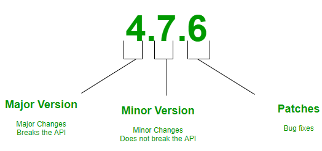

# npm
My works related to Node Package Manager - npm

## Table of Contents
1. [Introduction.](#introduction)
2. [Official references websites.](#references)
3. [Semantic versioning.](#versioning)
4. [GitHub notes.](#github)
5. [GitHub repository calculation.](#calculation)

<a name="introduction"></a>
## 1. Introduction.
 
npm (originally short for Node Package Manager) is a package manager for the JavaScript programming language. It is the default package manager for the JavaScript runtime environment Node.js. It consists of a command line client, also called npm, and an online database of public and paid-for private packages, called the npm registry. The registry is accessed via the client, and the available packages can be browsed and searched via the npm website. The package manager and the registry are managed by npm, Inc.

<a name="references"></a>
## 2. Official references websites. <br />
npm official website : https://www.npmjs.com <br />
node.js official website : https://nodejs.org <br />

**_npm tools_** <br />
npm semver calculator : https://semver.npmjs.com <br />

**_npm packages_** <br />
Moment.js to Parse, validate, manipulate, and display dates and times in JavaScript. : https://momentjs.com <br />
browserify lets you require('modules') in the browser by bundling up all of your dependencies : http://browserify.org, https://github.com/browserify/browserify <br />
Set.js, Create an array of items and then pass it to Set : https://www.npmjs.com/package/set <br />
get : https://www.npmjs.com/package/get <br />
lodash : https://www.npmjs.com/package/lodash <br />
gulp : https://www.npmjs.com/package/gulp <br />
uuidv4 : https://www.npmjs.com/package/uuidv4 <br />
Live Server : https://www.npmjs.com/package/live-server <br />
http-server : https://www.npmjs.com/package/http-server <br />
npx :  https://www.npmjs.com/package/npx <br />
node-pre-gyp : https://www.npmjs.com/package/node-pre-gyp <br />
create-react-app : https://www.npmjs.com/package/create-react-app <br />
lite-server : https://www.npmjs.com/package/lite-server <br />

**_npm documentation by npmjs_** <br />
npm-init by npmjs : https://docs.npmjs.com/cli/init <br />
npm-fund by npmjs : https://docs.npmjs.com/cli-commands/fund.html <br />
npm-config by npmjs : https://docs.npmjs.com/cli/config <br />
Package name guidelines by npmjs : https://docs.npmjs.com/package-name-guidelines <br />
Try the latest stable version of npm by npmjs : https://docs.npmjs.com/try-the-latest-stable-version-of-npm <br />

**_npm related articles_** <br />
What is the difference between --save and --save-dev? by Stack Overflow : https://stackoverflow.com/questions/22891211/what-is-the-difference-between-save-and-save-dev <br />
npm vs npx — What’s the Difference? by freeCodeCamp : https://www.freecodecamp.org/news/npm-vs-npx-whats-the-difference/ <br />

**_npm projects in GitHub_** <br />
Upgrade npm on Windows by Felix Rieseberg : https://github.com/felixrieseberg/npm-windows-upgrade <br />

**_npm developers_** <br />
Felix Rieseberg : https://github.com/felixrieseberg <br />

<a name="versioning"></a>
## 3. Semantic versioning.
 
Patch : A patch is released when there are some bug fixes in the package.
<br /><br />
Minor : A minor release means some new features may have been added to the package but it won’t break the existing APIs. So when the developers add something new to the package they release a minor version.
<br /><br />
Major : A major version is released when there are some changes in the package that can potentially break the APIs used in the existing application, dependent on that package. Which means some APIs may behave differently, some may not exist anymore which can lead to break an application dependent on that package.
<br /><br />
Caret ^ : “^4.7.6” means, the application is ready for any Minor or Patch releases on the version 4 of the package. Which means if someone downloads the application from git and installs the npm dependencies and by then the developer has released a version 4.7.7, npm will eventually download that latest version for him. We can write it in another way like “4.x”. They both mean the same.
<br /><br />
Tilde ~ : “~4.7.6” means, the application is ready for any only patch releases on the version 4.7 of the package. Which means if someone downloads my application from git and installs the npm dependencies and by then mongoose has released a version 4.7.7, npm will eventually download that latest version for him. We can write it in another way like “4.7.x”. They both mean the same.
<br /><br />
Semantic versioning official reference : https://docs.npmjs.com/about-semantic-versioning

<a name="github"></a>
## 4. GitHub notes.
Clone the current GitHub remote repository contents into local machine.
```
$ git clone https://github.com/syakirharis25/npm.git
$ cd npm/
$ git remote -v
$ git status
```

<a name="calculation"></a>
## 5. GitHub repository calculation.
```
-------------------------------------------------------------------------------
Language                     files          blank        comment           code
-------------------------------------------------------------------------------
JavaScript                    1789          16511          39206         105252
JSON                           218              0              0          29353
Markdown                       251          12221              0          28928
C/C++ Header                    21           1148            351           5984
TypeScript                      11            204            487            865
Bourne Shell                     5            171            112            843
diff                             1              3             13            588
CSS                              2              5              4            249
YAML                            15             10              4            174
HTML                             9             15              1            159
DOS Batch                        4              8              0             60
PowerShell                       4              4             12             56
JSON5                            1              0              0             55
make                             4             20              4             42
SVG                              1              1              0             13
-------------------------------------------------------------------------------
SUM:                          2336          30321          40194         172621
-------------------------------------------------------------------------------

```
Refer to : https://github.com/syakirharis25/cloc
